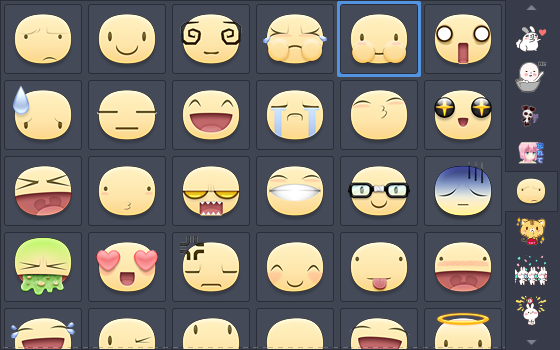

## Stickers Popup

A simple GTK+ 3 app that displays locally stored stickers and allows for visual selection of stickers to the system clipboard (with vi key bindings!)

Run `./src/main.py` to test.
